# HackerRank Code Review Assistant Skill

This skill guides you and AI assistants in conducting rigorous, high-quality, and structured code reviews for HackerRank competitive programming solutions. It defines the workflow for generating comprehensive review prompts (with input plumbing removed), evaluating submissions in any LLM chat (ChatGPT, Claude, Gemini, DeepSeek, local models), and importing the structured JSON response back into the HackerRank Solutions Hub dashboard.

---

## 1. Core Workflow Overview

```mermaid
flowchart LR
    A["Select Solution in Dashboard"] --> B["Click 'Copy Prompt for LLM'"]
    B --> C["Paste into any LLM Chat"]
    C --> D["LLM returns Structured JSON"]
    D --> E["Paste into 'Import LLM Review' box"]
    E --> F["Click 'Process & Apply Review'"]
    F --> G["Review Decision & Draft Line Comments Loaded"]
    G --> H["Publish Review Round & Approve Line Comments"]
```



1. **Prompt Generation**: The dashboard or backend strips standard competitive programming I/O plumbing (leaving only the core algorithmic function) and gathers the problem statement, historical review rounds, and past comments into a structured prompt.
2. **LLM Evaluation**: You paste the prompt into any external LLM chat. The LLM audits time/space complexity, correctness, edge cases, and code style.
3. **Structured Response**: The LLM responds strictly with a parseable JSON block matching the schema.
4. **Dashboard Import**: You paste the JSON into the dashboard and click **"Process & Apply Review"**. The dashboard automatically populates the review decision status, detailed notes breakdown, ratings, and line-targeted draft comments in the Monaco editor.
5. **Publish Round**: Approve/reject individual line comments and click **"Publish Review Round"**.

---

## 2. Input Plumbing Stripping Rules

HackerRank solutions contain standard I/O boilerplate that obscures the core algorithm. The review prompt excludes this plumbing while preserving the algorithm logic and referencing original source line numbers:

| Language | Boilerplate Stripped | Preserved Core Logic |
| :--- | :--- | :--- |
| **Python** | Shebang (`#!/bin/python3`), standard `import sys, os, math`, `if __name__ == '__main__':` reading stdin and writing `OUTPUT_PATH`. | Function definitions (`def ...`), helper classes, and custom algorithms. |
| **JavaScript / TypeScript** | `'use strict'`, `const fs = require('fs')`, `process.stdin.resume()`, `function readLine()`, `function main() { const ws = ... }`. | Exported/solution function (e.g. `function simpleArraySum(ar) { ... }`). |
| **C++** | `#include <bits/stdc++.h>`, `using namespace std;`, `string ltrim(...)`, `string rtrim(...)`, `vector<string> split(...)`, `int main() { ... }`. | Core algorithm function (e.g. `int simpleArraySum(vector<int> ar)`) or class. |
| **Java** | `import java.io.*`, `public class Solution { public static void main(String[] args) ... }`, `BufferedReader`, `BufferedWriter`, `Scanner`. | The `Result` class or static solution method with business logic. |
| **Go** | `package main`, `import (...)`, `func checkError(...)`, `func readLine(...)`, `func main() { ... }`. | The algorithm function (e.g. `func simpleArraySum(ar []int32) int32`). |

---

## 3. Review Prompt Specification

When copying the prompt from the dashboard, it is structured as follows:

```markdown
You are a senior algorithmic software engineer and competitive programming code reviewer conducting Review Round #<N> for a HackerRank submission.

# 1. Challenge Information
- Title: <Challenge Title>
- Slug: <challenge-slug>
- Language: <language>
- Submission Author: @<username>
- Challenge URL: https://www.hackerrank.com/challenges/<slug>/problem

# 2. Problem Statement
<Clean formatted text / markdown of the problem statement, constraints, input/output formats>

# 3. Candidate Solution Code (Core Algorithm, excluding I/O plumbing)
<Numbered code lines corresponding directly to the submitted source file>

# 4. Review Context & Previous History
### Previous Code Review Rounds:
- Round 1 (Status: CHANGES_REQUESTED, Reviewer: @Admin):
  Please optimize from O(N^2) to O(N log N) using a frequency map or sorting.
### Existing Community Comments & Line Reviews:
- [Line 18] @reviewer: Consider handling empty array edge case.

# 5. Evaluation Instructions & Criteria
Be very concise, sacrifice grammar for brevity.
1. Algorithmic Correctness & Logic
2. Time & Space Complexity (exact Big-O)
3. Edge Cases & Boundary Analysis
4. Follow-up on Previous Feedback (verify if previous review rounds/comments were addressed)
5. Code Style, Cleanliness & Idiomatic Practices
6. Decision & Line Comments (RECOMMEND APPROVED or CHANGES_REQUESTED)

# 6. Response Format Requirement
Respond ONLY with a valid, parseable JSON object enclosed in a ```json ``` code fence.
```

---

## 4. Required LLM JSON Output Schema

The external LLM must format its response matching this exact schema:

```json
{
  "status": "APPROVED",
  "complexity": "Time: O(N log N), Space: O(1)",
  "clevernessScore": 4,
  "readabilityScore": 5,
  "summary": "Concise summary of the solution's logic, correctness, and evaluation.",
  "strengths": [
    "Optimal time complexity O(N log N) with in-place sorting.",
    "Clean early return for base cases."
  ],
  "edgeCases": "Handles empty arrays, single elements, and all-duplicate arrays correctly.",
  "suggestions": [
    "Add explicit comments clarifying the two-pointer invariant."
  ],
  "adminNotes": "Official review round notes and decision justification for Round #1.",
  "lineComments": [
    {
      "startLine": 18,
      "endLine": 22,
      "type": "SUGGESTION",
      "content": "Consider using binary search instead of linear scan to reduce lookup time from O(N) to O(log N)."
    }
  ]
}
```

### Field Definitions:
- **`status`** *(string)*: `"APPROVED"` (passes review), `"CHANGES_REQUESTED"` (needs refactoring/optimization), or `"DRAFT"` (preliminary notes).
- **`complexity`** *(string)*: Big-O analysis (e.g. `"Time: O(N), Space: O(1)"`).
- **`clevernessScore`** *(integer 1-5)*: Assessment of algorithmic elegance and creativity.
- **`readabilityScore`** *(integer 1-5)*: Assessment of code clarity, naming, and formatting.
- **`summary`** *(string)*: High-level overview of the solution approach and review verdict.
- **`strengths`** *(array of strings)*: Key strengths of the submission.
- **`edgeCases`** *(string)*: Detailed boundary and edge case audit.
- **`suggestions`** *(array of strings)*: High-level actionable recommendations.
- **`adminNotes`** *(string)*: Official notes recorded in the review round history.
- **`lineComments`** *(array of objects)*: Line-targeted review feedback:
  - `startLine` *(integer)*: 1-based start line in the Monaco editor.
  - `endLine` *(integer)*: 1-based end line (optional / same as `startLine`).
  - `type` *(string)*: `"SUGGESTION"` | `"ISSUE"` | `"PRAISE"` | `"NOTE"`.
  - `content` *(string)*: Actionable line-level review comment.

---

## 5. Iterative Code Review Rounds Guide

- **Round 1 (Initial Review)**:
  - Focus on initial algorithmic correctness, asymptotic complexity, and obvious flaws.
  - If suboptimal, specify `status: "CHANGES_REQUESTED"` with clear guidance on the expected Big-O target.
- **Round 2+ (Follow-up Rounds)**:
  - Check the previous round's `adminNotes` in section 4 of the prompt.
  - Verify whether the candidate addressed the specific issues raised in previous rounds.
  - If resolved, approve with `status: "APPROVED"`. If issues persist, detail what remains unresolved.

---

## 6. Dashboard Integration Steps

1. In the active solution workspace, switch to the **`AI & Admin Reviews`** sidebar sub-tab.
2. Click **`Copy Prompt for LLM`** (uses the pixel art copy button).
3. (Optional) Click **`Preview`** to inspect the prompt text directly in the dashboard.
4. Paste the prompt into your preferred LLM chat and receive the JSON response.
5. Copy the entire LLM response and paste it into the **`Paste LLM Review Response`** textarea.
6. Click **`Process & Apply Review`**.
7. Observe the **Parsed Review Highlights** card, updated decision status, notes, and Monaco editor line comment viewzones.
8. Approve or reject individual draft comments as desired.
9. Click **`Publish Review Round`** to record the official review in the database.
